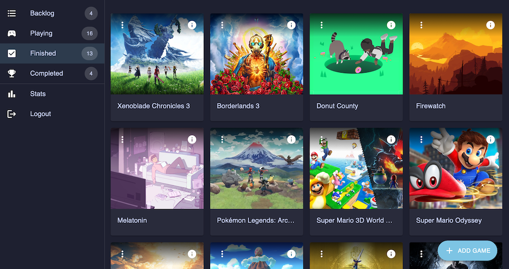

     

## About

The mission behind Backloggr is a simple one: to provide a free, open-source tool to manage your gaming backlog.

Unlike other backlogging services, Backloggr gives you the opportunity to own your data by making it easy to export your entire backlog to a JSON file. Also, the license allows you to fork and deploy to any hosting service that supports web apps built with [Next.js](https://nextjs.org/) (I suggest [Vercel](https://vercel.com/) or [Netlify](https://www.netlify.com/)), and connect to a database on [MongoDB Atlas](https://www.mongodb.com/cloud/atlas).

## Using Backloggr

The easiest way to use Backloggr is to visit [Backloggr.net](https://backloggr.net), and sign in with your Discord account.

### Installing PWA

Backloggr is a PWA, or Progressive Web App, which you can install in Chrome, or on your mobile device.

## Deploying Your Own Version

To deploy your own version of Backloggr, you will need the following:

- Familiarity with Next.js or React
- A hosting provider like [Vercel](https://vercel.com/) or [Netlify](https://www.netlify.com/)
- An account with [MongoDB Atlas](https://www.mongodb.com/cloud/atlas)\*
- An API key from [RAWG API](https://api.rawg.io/docs/)\*
- A developer key from [Discord](https://discord.com/developers)\*

\* Feel free to modify your fork to use other alternatives, but these are what Backloggr is built around.

You will need to supply the following environmental variables in your environment:

- `MONGODB_URI` - Authenticated URL to your MongoDB database
- `RAWG_API_KEY` - Your unique API key from RAWG API
- `NEXTAUTH_SECRET` - A random, cryptographically strong key for authenticating with NextAuth
- `NEXTAUTH_URL` - The URL that NextAuth should redirect to when a user has logged in
- `DISCORD_CLIENT_ID` - Your app ID from Discord
- `DISCORD_CLIENT_SECRET` - A random, cryptographically strong key for authenticating with Discord

## License

Backloggr

Copyright (C) 2022-2023 Graham Hall

This program is free software: you can redistribute it and/or modify
it under the terms of the GNU General Public License as published by
the Free Software Foundation, either version 3 of the License, or
(at your option) any later version.

This program is distributed in the hope that it will be useful,
but WITHOUT ANY WARRANTY; without even the implied warranty of
MERCHANTABILITY or FITNESS FOR A PARTICULAR PURPOSE. See the
GNU General Public License for more details.

You should have received a copy of the GNU General Public License
along with this program. If not, see <https://www.gnu.org/licenses/>.

## Questions

If you have any questions, concerns, comments, etc., feel free to [reach out to me on Mastodon](https://home.social/@ghalldev).
